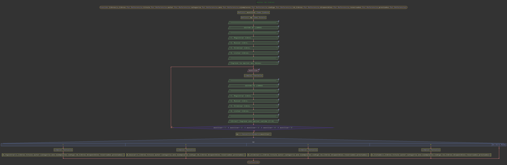
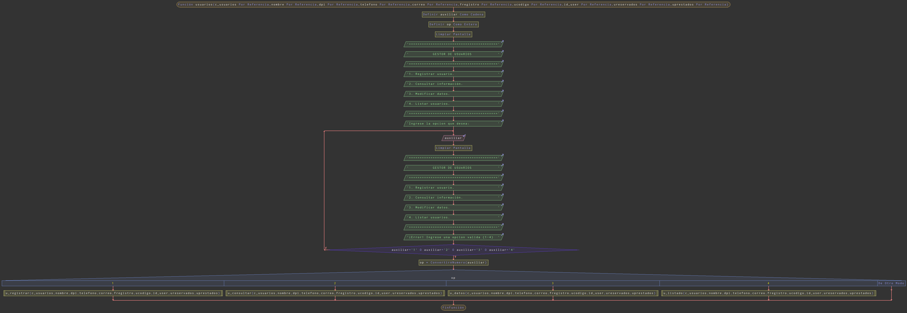
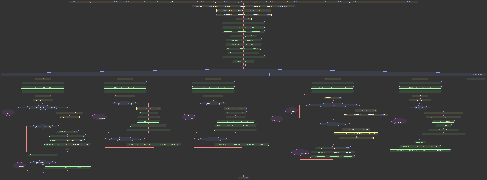

# Documentación - Proyecto 2: Sistema Digital de Gestión de Biblioteca

## Universidad de San Carlos de Guatemala
**Facultad de Ingeniería**
**Curso:** Introducción a los algoritmos y flujo de datos


---

## Resumen

El proyecto **Sistema Digital de Gestión de Biblioteca** tiene como objetivo automatizar los procesos que actualmente se realizan de forma manual en la Biblioteca Universitaria “Luz del Saber”. Este sistema fue desarrollado en **PSeInt** aplicando principios de **programación estructurada**, uso de **arreglos** y control de flujo mediante estructuras **secuenciales, condicionales y repetitivas**.  

El programa está diseñado para permitir el **registro, consulta, modificación y eliminación de libros y usuarios**, así como la **gestión de préstamos, devoluciones, multas y reportes**.  Con ello se busca reducir los errores humanos, evitar duplicidad de registros y ofrecer una gestión más eficiente y confiable.

El sistema se estructura en cuatro módulos principales:  
1. **Gestión de libros**  
2. **Gestión de usuarios**  
3. **Préstamos y devoluciones**  
4. **Reportes y estadísticas**

---

## 1. Descripción general de la solución implementada

El sistema está compuesto por **submenús** que agrupan las funcionalidades de cada módulo.  Cada opción del menú dirige al usuario hacia un bloque de código que ejecuta las operaciones correspondientes mediante ciclos y estructuras condicionales.

La comunicación entre módulos se logra a través del uso de **arreglos paralelos**, que almacenan la información de los libros, usuarios y préstamos activos.

El programa inicia mostrando un menú principal, desde el cual el usuario puede elegir el proceso que desea realizar. Las operaciones están validadas para evitar errores comunes como duplicación de registros, préstamos de libros no disponibles o usuarios inexistentes.

---

## 2. Diagrama de flujo del proceso principal

A continuación, se debe incluir el **diagrama general del sistema** donde se observe el flujo entre los módulos principales.


El diagrama debe representar el menú principal y las llamadas a cada subproceso según la estructura general:

```
=========================================
        BIBLIOTECA UNIVERSITARIA         
             LUZ DEL SABER               
=========================================
1. Gestión de libros.                    
2. Gestión de usuarios.                  
3. Prestamos y Devoluciones.             
4. Reportes y Estadisticas.             
5. Salir.                                
=========================================
Ingrese la opcion que desea:             
```

---

## 3. Manual de usuario
### Requisitos previos
- Tener instalado **PSeInt** en el equipo.  
- Contar con el archivo `biblioteca.psc`.  

### Pasos de uso
1. Abrir el archivo en PSeInt.  
2. Ejecutar el algoritmo con **F9**.  
3. Seleccionar una opción del menú principal.  
4. Seguir las instrucciones que aparecen en pantalla.  

## 3.1 Gestión de Libros

### Funcionalidad
Permite registrar, modificar, eliminar, buscar y listar libros dentro del sistema.  
Cada libro tiene un **código único** generado automáticamente para garantizar su unicidad.

### Datos manejados
- Código de libro (automático)
- Título
- Autor
- Categoría o género
- Año de publicación
- Número de ejemplares disponibles
- Estado (Disponible / Prestado / Reservado)

### Procesos principales
- **Registrar libro:** se ingresan los datos y se guarda en los vectores.  
- **Buscar libro:** permite filtrar por título, autor o código.  
- **Modificar libro:** actualiza datos existentes.  
- **Eliminar libro:** solo si el libro no tiene préstamos activos.  
- **Listar libros:** muestra en pantalla todos los libros registrados.

### Diagrama del módulo



El diagrama debe representar el menú principal y las llamadas a cada subproceso según la estructura general:
```
=========================================
            GESTOR DE LIBROS             
=========================================
1. Registrar libro.                      
2. Buscar libro.                         
3. Eliminar libro.                       
4. Listar libros.                        
=========================================
Ingrese la opcion que desea:             
```
---

## 3.2 Gestión de Usuarios

### Funcionalidad
Administra la información de los usuarios registrados en la biblioteca.  
Cada usuario posee un **ID generado automáticamente** y puede tener un historial de préstamos.

### Datos manejados
- ID de usuario (automático)
- Nombre completo
- Carnet o DPI
- Teléfono
- Correo electrónico
- Fecha de registro

### Procesos principales
- Registrar nuevos usuarios.  
- Modificar datos personales.  
- Consultar información específica.  
- Listar todos los usuarios registrados.

### Diagrama del módulo



El diagrama debe representar el menú principal y las llamadas a cada subproceso según la estructura general:
```
=========================================
           GESTOR DE USUARIOS            
=========================================
1. Registrar usuario.                    
2. Consultar información.                
3. Modificar datos.                      
4. Listar usuarios.                      
=========================================
Ingrese la opcion que desea:             
```
---

## 3.3 Préstamos y Devoluciones
### Funcionalidad
Automatiza el control de préstamos, devoluciones y cálculo de multas.  
El sistema valida disponibilidad del libro, cantidad máxima por usuario y mora en las entregas.

### Datos manejados
- Código de préstamo
- ID de usuario
- Código del libro
- Fecha de préstamo
- Fecha de devolución esperada
- Días de atraso
- Multa calculada

### Procesos principales
- **Registrar préstamo:** verifica disponibilidad y registra fechas.  
- **Registrar devolución:** actualiza estado del libro y calcula multa si hay atraso.  
- **Registrar pago de multa:** actualiza el historial del usuario.  
- **Listar préstamos activos:** muestra todos los libros actualmente prestados.

### Ejemplo de cálculo de multa
```
Multa = Días de atraso × Q1.00
```

### Diagrama del módulo


```
=========================================
        PRESTAMOS Y DEVOLUCIONES         
=========================================
1. Prestar libro.                        
2. Devolver libro.                       
3. Gestionar multas.                     
4. Gestionar prestamos activos.          
5. Listado de prestamos.                 
=========================================
Ingrese la opcion que desea:             
```

---

## 3.4 Reportes y Estadísticas

### Funcionalidad
Genera reportes básicos sobre la actividad de la biblioteca, útiles para la administración.

### Tipos de reportes
- Libros más prestados.  
- Usuarios con más préstamos activos.  
- Libros con reservas pendientes.  
- Total de libros por categoría.  
- Multas activas y pagadas.

### Diagrama del módulo



```
=========================================
          REPORTES Y ESTADISTICAS        
=========================================
1. Libros más prestados.                 
2. Usuarios con préstamos activos.       
3. Libros con reservas pendientes.       
4. Total de libros por categoría.        
5. Reporte de multas activas.            
=========================================
Ingrese la opcion que desea:             
```
### Ejemplo de interacción
```
=========================================
        BIBLIOTECA UNIVERSITARIA         
             LUZ DEL SABER   
=========================================
1. Gestión de Libros
2. Gestión de Usuarios
3. Préstamos y Devoluciones
4. Reportes
5. Salir
=========================================
Ingrese la opcion que desea:  
> 1
=========================================
            GESTOR DE LIBROS             
=========================================
1. Registrar libro.                      
2. Buscar libro.                         
3. Eliminar libro.                       
4. Listar libros.                        
=========================================
Ingrese la opcion que desea:  
> 1
=========================================
                Registrar             
=========================================
Título del libro: 
> CIEN AÑOS DE SOLEDAD
Autor del libro: 
> Gabriel García Márquez
Categoría/género del libro: 
> Ficción
Año del libro:
> 1967
Numero de ejemplares:
> 4
¡Libro agregado con exito! ID: 1032
Presione una tecla para regresar al Menú...
```

---

## 4. Estructuras de datos utilizadas

### Arreglos (los mas importantes)
Libros
- `titulo[]`: almacena los títulos de los libros.  
- `autor[]`: guarda el nombre de los autores.
- `categoria[]`: clasifica los libros por género. 
- `año[]`: año de publicación del libro.
- `ejemplares[]`: numero de ejemplares totales.
- `disponibles[]`: ejemplares disponibles.
- `reservados[]`: ejemplares reservados.
- `prestados[]`: ejemplares prestados.
- `codigo[]`: ID del libro.

Usuarios

- `nombre[25]`: almacena los nombres de los usuarios
- `dpi[25]`: guarda el dpi o carné de los usuarios.
- `telefono[25]`: telefono de los usuarios.
- `correo[25]`: correo de los usuarios.
- `fregistro[25]`: fecha de registro de los usuarios.
- `ucodigo[25]`: ID de los usuarios.
- `ureservados[25]`: numero de libros reservados por usuario.
- `uprestados[25]`: numero de libros prestados por usuario.
- `multa[25]`: almacena las multas.

### Variables auxiliares
- `c_libros`, `c_usuarios`, `contador_prestamos`: controlan la cantidad de registros activos.  
- `fecha_prestamo`, `fecha_devolucion`, `multa`: variables para el cálculo de fechas y penalizaciones.

---

## 5. Casos de prueba realizados

| N° | Caso de prueba | Descripción | Resultado esperado | Resultado obtenido |
|----|----------------|--------------|--------------------|--------------------|
| 1 | Registro de un libro | Ingreso de un nuevo libro con todos los campos válidos | Libro guardado correctamente | Correcto |
| 2 | Registro de usuario | Nuevo usuario con DPI único | Usuario registrado correctamente | Correcto |
| 3 | Préstamo válido | Usuario con menos de 3 préstamos solicita libro disponible | Préstamo aceptado | Correcto |
| 4 | Devolución con atraso | Usuario devuelve con 10 días de atraso | Multa de Q10.00 registrada | Correcto |
| 5 | Eliminación de libro prestado | Intento de eliminar libro actualmente en préstamo | Operación rechazada | Correcto |
| 6 | Reporte general | Mostrar libros más prestados | Listado generado | Correcto |

---

## 6. Limitaciones conocidas del sistema

- Los datos se almacenan temporalmente (no se guardan después de cerrar el programa).  
- No existe validación avanzada para fechas o correos electrónicos.  
- No hay interfaz gráfica, todo se ejecuta en consola.  
- Las búsquedas no son combinadas (solo por un campo a la vez).
---

## Conclusiones

El sistema cumple con los objetivos básicos del proyecto: automatizar el registro, préstamo y control de libros en una biblioteca.  Durante su desarrollo se aplicaron los conocimientos de **estructuras de control, arreglos, funciones y validaciones básicas**.  Se comprobó la importancia de organizar los datos de forma lógica y planificar la estructura de menús para mantener la claridad del flujo del programa.  Este proyecto permitió fortalecer el pensamiento algorítmico y la comprensión de cómo los procesos del mundo real pueden transformarse en lógica computacional.

---
 

**Carné:** 202504020
**Autor:** Patricio Manuel Romero Castellanos
**Fecha:** 24 / 10 / 2025
